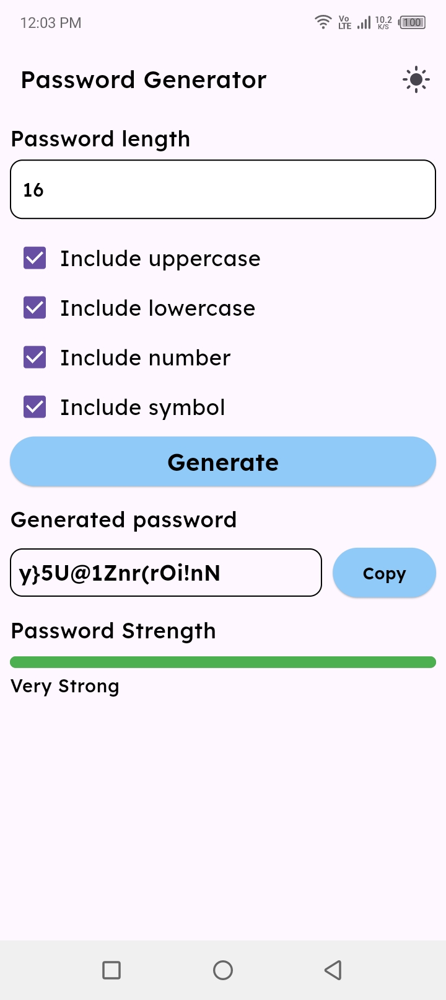

# Safe Password Generator

A secure and customizable password generator for Dart and Flutter. Generate strong passwords with
options for uppercase, lowercase, numbers, and special characters. Calculate password strength and
get strength labels.

## Features

- Generate secure passwords with customizable length
- Include/exclude uppercase, lowercase, numbers, and special characters
- Calculate password strength on a scale of 0 to 100
- Get password strength labels (e.g., "Very Strong", "Weak")
- Works in both **Dart** and **Flutter** environments

## Getting Started

Add the following to your `pubspec.yaml` file:

```yaml
dependencies:
  safe_password_generator: ^1.0.0
```

## Usage

Import the package where needed:

```dart
import 'package:safe_password_generator/safe_password_generator.dart';

void main() {
  // Generate a password
  final password = SafePasswordGenerator.generatePassword(
    length: 16,
    includeUppercase: true,
    includeLowercase: true,
    includeNumbers: true,
    includeSpecialCharacters: true,
  );
  print('Generated Password: $password');

  // Calculate password strength
  final strength = SafePasswordGenerator.calculatePasswordStrength(password);
  print('Password Strength: ${strength.toStringAsFixed(2)}%');

  // Get strength label
  final label = SafePasswordGenerator.getStrengthLabel(strength);
  print('Strength Label: $label');
}
```

For more examples, check out the [Advanced Example](example/example.dart).

## Screenshots



## API Reference

For detailed API documentation, visit the [API reference](https://pub.dev/packages/safe_password_generator).